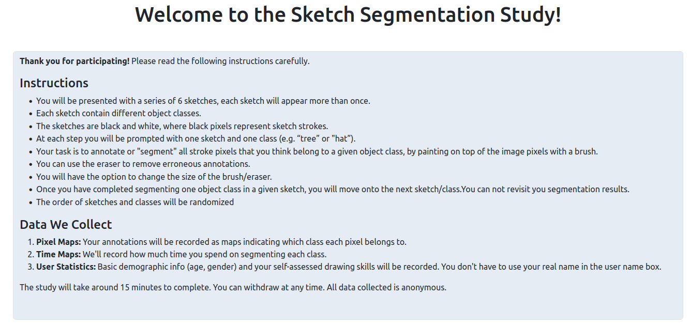
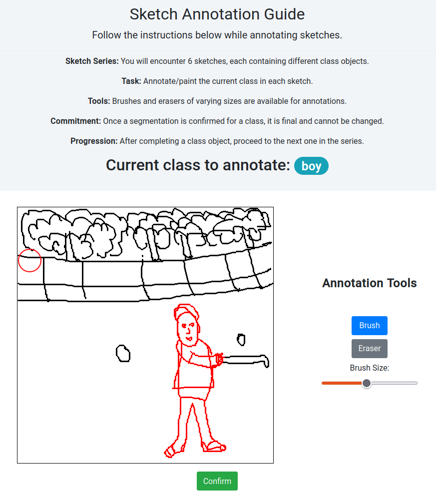

# human-model-alignment
The following is the code for the implementation and deployment of the web interface for the user study conducted in our CVPR'24 paper https://ahmedbourouis.github.io/Scene_Sketch_Segmentation/

# Sketch groups
We identified four distinct sketch groups that are challenging for our model: 
1. Ambiguous sketches: sketches where it might be hard even for a human observer to understand an input sketch;
2.  Interchangeable categories: sketches containing multiple objects with labels that can interchange each other, like ‘tower’ and ‘building’, or ‘girl’ and ‘man’;
3. Correlated categories: sketches with categories that typically co-occur in scenes, e.g., ‘train’- ‘railway’ and ‘airplane’-‘runway’; and
4. merous-categories: sketches with six or more categories.

We supplement these four groups with sketches where our model labels correctly more than 80% of pixels: 

5. Strong performance.

# Participants
We recruited 25 participants (14 male) for this study. Each participant was randomly assigned six sketches: 1 from each of the first 4 groups and 2 from the 5th group, such that every sketch was annotated by five unique participants. 


# User Instructions
<div align="center">

</div>

# Annotation Interface
<div align="center">

</div>

# Citation
If you find this useful in your research, please consider citing:
```
@misc{bourouis2023open,
title={Open Vocabulary Semantic Scene Sketch Understanding}, 
author={Ahmed Bourouis and Judith Ellen Fan and Yulia Gryaditskaya},
year={2023},
eprint={2312.12463},
archivePrefix={arXiv},
primaryClass={cs.CV}
}
```
